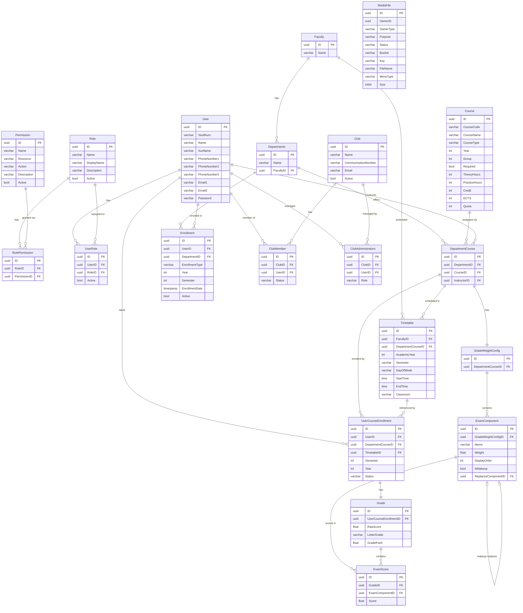

```mermaid
erDiagram
    Faculty {
        uuid ID PK
        varchar Name
    }

    Departments {
        uuid ID PK
        varchar Name
        uuid FacultyID FK
    }

    User {
        uuid ID PK
        varchar StudNum
        varchar Name
        varchar SurName
        varchar PhoneNumber1
        varchar PhoneNumber2
        varchar PhoneNumber3
        varchar Email1
        varchar Email2
        varchar Password
    }

    Role {
        uuid ID PK
        varchar Name
        varchar DisplayName
        varchar Description
        bool Active
    }

    Permission {
        uuid ID PK
        varchar Name
        varchar Resource
        varchar Action
        varchar Description
        bool Active
    }

    RolePermission {
        uuid ID PK
        uuid RoleID FK
        uuid PermissionID FK
    }

    UserRole {
        uuid ID PK
        uuid UserID FK
        uuid RoleID FK
        bool Active
    }

    Course {
        uuid ID PK
        varchar CourseCode
        varchar CourseName
        varchar CourseType
        int Year
        int Group
        bool Required
        int TheoryHours
        int PracticeHours
        int Credit
        int ECTS
        int Quota
    }

    DepartmentCourse {
        uuid ID PK
        uuid DepartmentID FK
        uuid CourseID FK
        uuid InstructorID FK
    }

    Enrollment {
        uuid ID PK
        uuid UserID FK
        uuid DepartmentID FK
        varchar EnrollmentType
        int Year
        int Semester
        timestamp EnrollmentDate
        bool Active
    }

    UserCourseEnrollment {
        uuid ID PK
        uuid UserID FK
        uuid DepartmentCourseID FK
        uuid TimetableID FK
        int Semester
        int Year
        varchar Status
    }

    Timetable {
        uuid ID PK
        uuid FacultyID FK
        uuid DepartmentCourseID FK
        int AcademicYear
        varchar Semester
        varchar DayOfWeek
        time StartTime
        time EndTime
        varchar Classroom
    }

    GradeWeightConfig {
        uuid ID PK
        uuid DepartmentCourseID FK
    }

    ExamComponent {
        uuid ID PK
        uuid GradeWeightConfigID FK
        varchar Name
        float Weight
        int DisplayOrder
        bool IsMakeup
        uuid ReplacesComponentID FK
    }

    Grade {
        uuid ID PK
        uuid UserCourseEnrollmentID FK
        float RawScore
        varchar LetterGrade
        float GradePoint
    }

    ExamScore {
        uuid ID PK
        uuid GradeID FK
        uuid ExamComponentID FK
        float Score
    }

    Club {
        uuid ID PK
        varchar Name
        varchar CommunicationNumber
        varchar Email
        bool Active
    }

    ClubMember {
        uuid ID PK
        uuid ClubID FK
        uuid UserID FK
        varchar Status
    }

    ClubAdministrators {
        uuid ID PK
        uuid ClubID FK
        uuid UserID FK
        varchar Role
    }

    MediaFile {
        uuid ID PK
        uuid OwnerID
        varchar OwnerType
        varchar Purpose
        varchar Status
        varchar Bucket
        varchar Key
        varchar FileName
        varchar MimeType
        int64 Size
    }

    %% Relationships
    Faculty ||--o{ Departments : "has"
    Faculty ||--o{ Timetable : "schedules"

    Departments ||--o{ DepartmentCourse : "offers"
    Departments ||--o{ Enrollment : "enrolls into"

    Course ||--o{ DepartmentCourse : "assigned via"

    User ||--o{ UserRole : "has"
    User ||--o{ Enrollment : "enrolled in"
    User ||--o{ UserCourseEnrollment : "takes"
    User ||--o{ DepartmentCourse : "instructs"
    User ||--o{ ClubMember : "member of"
    User ||--o{ ClubAdministrators : "manages"

    Role ||--o{ RolePermission : "has"
    Role ||--o{ UserRole : "assigned to"
    Permission ||--o{ RolePermission : "granted via"

    DepartmentCourse ||--o{ UserCourseEnrollment : "enrolled by"
    DepartmentCourse ||--|| GradeWeightConfig : "has"
    DepartmentCourse ||--o{ Timetable : "scheduled in"

    Timetable ||--o{ UserCourseEnrollment : "referenced by"

    GradeWeightConfig ||--o{ ExamComponent : "contains"

    ExamComponent ||--o{ ExamScore : "scored in"
    ExamComponent |o--o| ExamComponent : "makeup replaces"

    UserCourseEnrollment ||--|| Grade : "has"

    Grade ||--o{ ExamScore : "contains"

    Club ||--o{ ClubMember : "has"
    Club ||--o{ ClubAdministrators : "managed by"
```